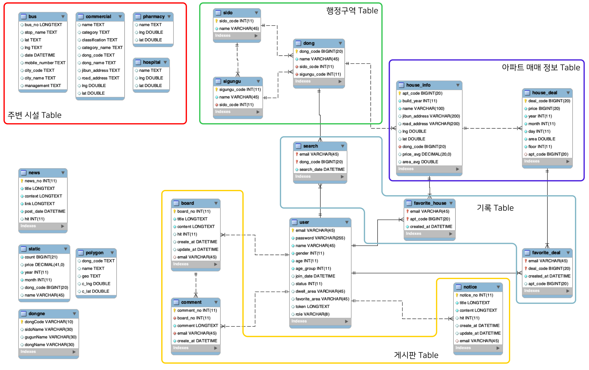
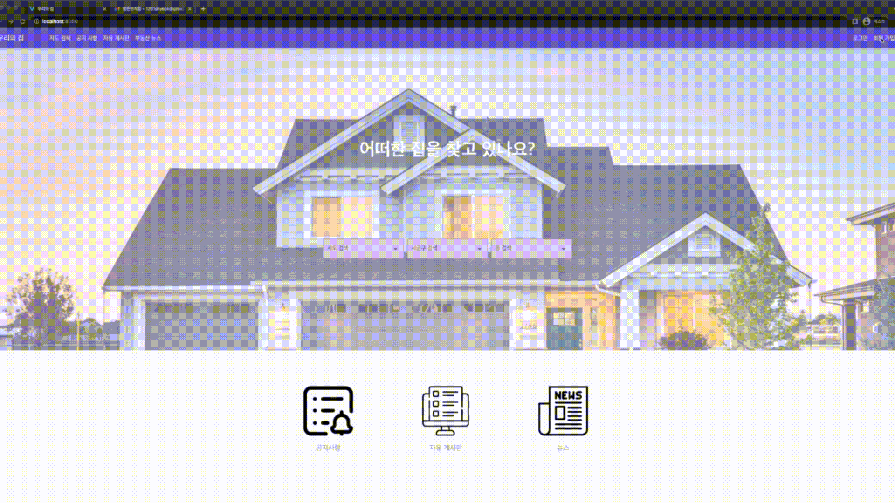
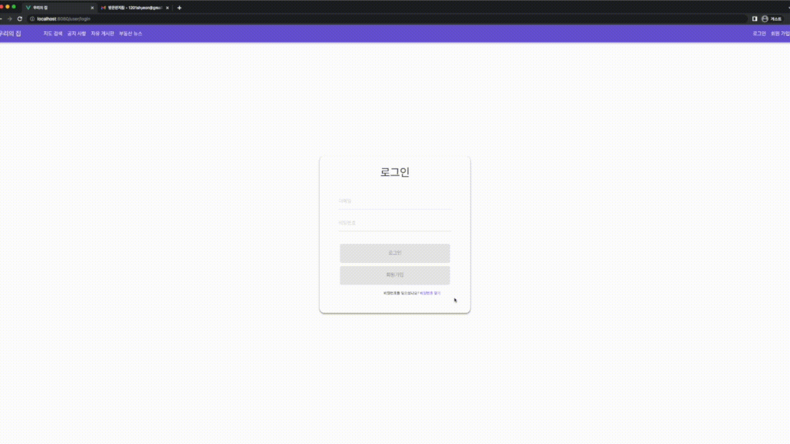
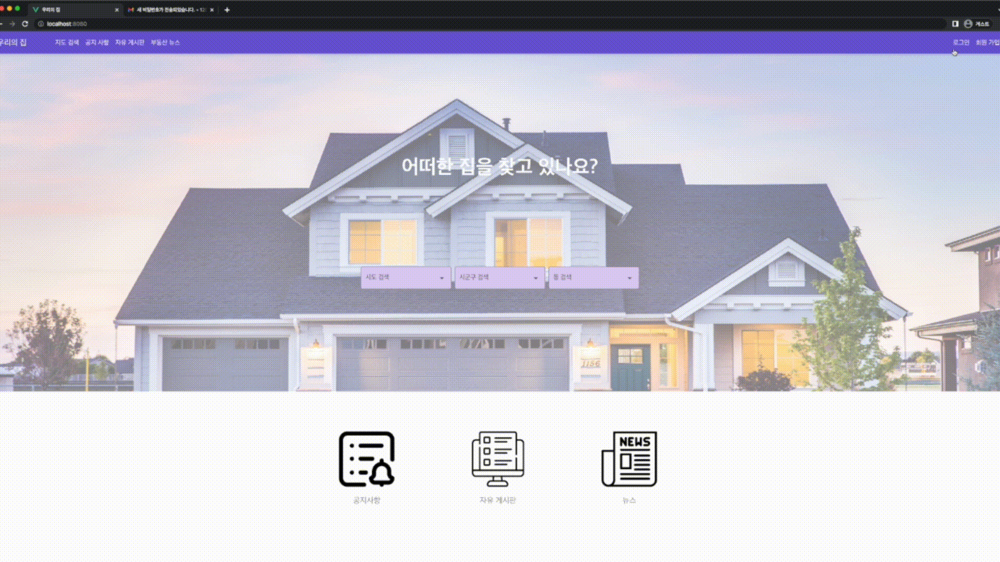

# OurHouse - 부동산 공공데이터 웹서비스
> 공공데이터를 이용한 부동산(아파트) 정보 제공 웹 사이트로 유저에게 아파트 매매 정보를 조회 또는 게시판 등의 커뮤니티 서비스를 제공하는 사이트입니다

 

### 프로젝트 기간 
- 2023.05.17 ~ 2023.05.26

 

### 개발환경 🛠️
>
> Java 8.
> >
> Spring Boot 2.7.11
> > 
> MyBatis 2.3.0
> >
> MySQL 5.6.30
> >
> Vue.JS 2.7.14
> >
> Vuetify 2.6.0
> >

 

## 0. 팀원

| 팀원| 역할 | 담당 | 파트 |
|:---|:---|:---|:---|
|강승현|팀원| Front End | 공지사항, 자유게시판, 뉴스게시판, 대시보드, DB |
|김정은|팀원| Front End | 지도 출력, 유저 및 관리자 백엔드 |
|김민수|팀원| Front End | 지도 UI, JWT, 메인페이지 |

### 수행 역할
| 개발 분야| 역할 |
|:---:|:---|
|페이지 구성| - Figma를 활용한 페이지 UI 구성|
|게시판 구현| - 공지사항, 자유 게시판 구현   - 각 게시글 댓글 기능 구현   - SpringScheduler와 Naver API를 활용한 자동 뉴스 크롤링으로 부동산 뉴스 게시판 구현|
|대시보드 구현| - ChartJS 기반 통계 그래프 구현   - Kakao Map API와 지리 데이터를 활용한 행정구역 정보 표시 구현|

---
## 1. ERD 구조

 

## 2. 구현 목록

| 분류 | 구현 기능 | 상세 설명 |
| --- | --- | --- |
| 공통 | 네비게이션 바 | 페이지의 전환 기능 |
| 메인 페이지 | 아파트 및 거래 관심 순위 | 아파트와 매매 거래내역의 관심을 상위 5개 항목 구성 게시판 리스트 |
| 유저 페이지 | 이용약관 | 개인정보수집이용 동의,마케팅 정보 수신(선택) |
|  | 회원 가입 | 회원정보(아이디, 비밀번호, 이름, 나이, 성별, 거주지역, 관심지역) 입력하여 가입 |
|  | 비밀번호 찾기 | 이메일과 이름 입력 시 Spring을 이용하여 이메일 전송 |
|  | 회원정보 수정 | 기존 회원의 정보를 수정하는 페이지 |
| 관리자 페이지 | 유저 관리 | 유저를 관리하는 페이지 |
| 지도 검색 페이지 | 지도 검색(아파트) | 시도,시군구,읍면동 3가지 정보를 선택해당 지역에서 거래 내역이 존재 하는 아파트 리스트 검색 |
|  | 지도 검색(거래 내역) | 아파트 리스트를 클릭 시 간단한 정보와 리스트 출력(특정 기준으로 정렬 기능 구현) |
|  | 관심 지정 | 아파트, 매물별로 관심 항목 선택 |
|  | 상세 검색 | 거래 기간, 가격대, 면적, 층 수를 기준으로 상세검색 |
| 대시보드 페이지 | 대시보드 | 관심지역 또는 거주지역 설정 시 해당 지역의 통계 정보 출력(연도별 평균 가격, 연도 및 월별 총 거래량,연령 및 성별 선호도, 지역 경계 Polygon) |
| 게시판 페이지 | 자유 게시판 | 관리자, 유저CRUD가능, 비 유저는 읽기만 가능 |
|  | 공지사항 | 관리자만 CRUD 가능 |
|  | 뉴스 게시판 | CRUD 불가능, SpringScheduler 이용하여 매일 9시 뉴스 자동 갱신 |

## 3. 웹 사이트 예시 

### 유저 페이지
- 회원가입 및 로그인(Frontend 개발)

 

- 비밀번호 찾기 : 랜덤 임시 비밀번호 발급

 

### 대시보드
- 회원정보 기본 설정(관심지역, 거주지역) 설정 시 해당 지역에 대한 대시보드 페이지 구현
- 연도별 평균 가격, 연도 및 월별 총 거래량, 연령 및 성별 선호도, 지역 경계 Polygon

 

### 자유 게시판
- 유저, 관리자 작성 및 댓글 기능 구현

 

### 공지사항
- 관리자 작성 기능 구현

 

### 뉴스게시판
- Spring Scheduler를 이용하여 매일 9시에 자동으로 게시판 최신화
- 리스트의 링크 클릭 시 기사 원문 페이지로 이동

## 배운점 / 느낀점

### 배운점

- Spring을 활용하여 REST API를 활용하여 백엔드 개발의 기본인 CRUD, 데이터베이스 연동, Scheduler를 통한 자동화를 경험했습니다.
- Vue.JS를 활용하여 MVVM의 구조를 경험하고 JavaScript를 통한 KakaoMap API와 지도 데이터 분석 프로젝트 진행시 활용했던 국토공간정보를 활용하여 Polygon의 구현을 경험했습니다.
- 기획 인턴 경험을 살려 프로젝트를 준비했지만 기획자의 생각과 개발자의 생각의 차이에 대해 다시 한번 생각하게 되었습니다.

### 느낀점

- 하나의 큰 규모의 서비스를 만들기 위해서는 다양한 직무가 필요하다.
    - 하나의 서비스를 만들기 위해 기획부터 개발까지 모두 직접 진행해보니 서비스에서 고려해야 하는 사항이 많고 전문적인 지식의 필요성을 느끼게 되었습니다. 또한 모든 과정을 한번에 진행하니 한 분야에 집중하는 것에 생각보다 많은 제한이 있었습니다. 기업에서 백엔드, 프론트엔드, 기획자, QA, 디자이너 등 직무를 나눠 개발하는 이유에 대해 다시 한번 생각하게 되는 계기가 되었습니다.
    
    - 성장하고 있다.
        - 비전공자로서 개발 관련 지식이 많이 부족했지만 백엔드 서버 개발, 프론트엔드 페이지 구현, 서비스 기획을 한번에 경험하며 어느새 자연스럽게 프로젝트를 진행하는 모습을 보고 무관한 전공이여도 개발에 대한 관심과 노력이 있다면 개발자로서 성장할 수 있다는 자신감을 얻게 되었습니다.
